 

Full-stack dev · Hebrew-first products · obsessed with accessibility and applied AI

  

&nbsp;
&nbsp;
&nbsp;
&nbsp;
&nbsp;

 

**Daily**&nbsp;&nbsp;

**Native**&nbsp;&nbsp;

**Infra**&nbsp;&nbsp;

&nbsp;<b>the rest of the toolbox</b>

 

 

### 🛠️ What I'm building

| Project | What it does |
| --- | --- |
| [`DanielReader-Windows`](https://github.com/db1347/DanielReader-Windows) | OCR screen reader for Windows — reads any on-screen text aloud with live word highlighting. Hebrew + English, C#/.NET + WPF. |
| `DanielReader-Mac` 🔒 | The macOS original: menu-bar app, on-screen OCR, TTS with real-time highlighting. Swift. |
| `TendersApp` 🔒 | Hebrew tender search that actually understands intent — scraping, embeddings and semantic matching over public tenders. Next.js + pgvector. |
| `NavGuard IL` 🔒 | GPS anti-spoofing: ESP32-S3 firmware with EKF sensor fusion and a Kotlin/Compose companion over BLE. |
| `YeadutApp` 🔒 | Hebrew-first Jewish lifestyle app — zmanim, Hebrew calendar, Sefirat HaOmer, kosher Shabbat alarms. Flutter. |
| [`kotar2pdf`](https://github.com/db1347/kotar2pdf) | Turns Kotar's online book viewer into a real PDF. Python. |

🔒 = private repo

 

<!-- Cards are rendered daily into profile/ by .github/workflows/cards.yml -->
<picture>
  <source media="(prefers-color-scheme: dark)" srcset="./profile/stats-dark.svg" />
  <source media="(prefers-color-scheme: light)" srcset="./profile/stats-light.svg" />
  
</picture>
&nbsp;&nbsp;
<picture>
  <source media="(prefers-color-scheme: dark)" srcset="./profile/langs-dark.svg" />
  <source media="(prefers-color-scheme: light)" srcset="./profile/langs-light.svg" />
  
</picture>

  

<picture>
  <source media="(prefers-color-scheme: dark)" srcset="https://streak-stats.demolab.com?user=db1347&hide_border=true&background=0d1117&ring=7C3AED&fire=7C3AED&currStreakLabel=7C3AED&sideLabels=c9d1d9&currStreakNum=c9d1d9&sideNums=c9d1d9&dates=6e7681" />
  <source media="(prefers-color-scheme: light)" srcset="https://streak-stats.demolab.com?user=db1347&hide_border=true&background=ffffff&ring=7C3AED&fire=7C3AED&currStreakLabel=7C3AED&sideLabels=24292f&currStreakNum=24292f&sideNums=24292f&dates=57606a" />
  
</picture>

 

<picture>
  <source media="(prefers-color-scheme: dark)" srcset="https://raw.githubusercontent.com/db1347/db1347/output/github-snake-dark.svg" />
  <source media="(prefers-color-scheme: light)" srcset="https://raw.githubusercontent.com/db1347/db1347/output/github-snake.svg" />
  
</picture>

 

powered by coffee, bidirectional text, and an unreasonable number of side projects

  

